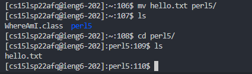

Logging into your Course Account
================================

Step 1: Installing VSCode
------
***
* Head to [this website](https://code.visualstudio.com/download) and download the appropriate version of VSCode for your system
* When you run the program after it has installed yours should look something like this:

 

Step 2: Remotely Connecting
-------
***
* Open a Terminal in VSCode by clicking on Terminal on the top bar and then clicking "New Terminal." Alternatively you can press (Ctrl+Shift+`)

* In the terminal type: ` ssh cs15lsp22**afq**@ieng6.ucsd.edu ` but replace **afq** with the relevant letters for your username, see the command in the terminal below:

* Next you'll be prompted for your password, Note: the password will not display when you type it in so be careful. It's advised to copy and paste your password in

* If you did this right you should see something similar to the image below. If that's the case, you're in!

Step 3: Testing Commands
------
***
* Now let's try entering a few commands, here are some you can try yourself:
    * `ls` provides a list of files in the current directory
    * `ls DIRECTORY_NAME` provides the list of files in a given directory
    *  `ls -a` Shows us the current files in the directory as well as hidden ones
    * `ls -lat` Shows the same list but with more detail and in a list format
    * `cd` Is used to change the current directory by specifying which directory you wish to change to
    * `cd ~` Is used to move back to the previous directory
    * `cat FILENAME` displays the context of a file
    * `pwd` shows the current path name of the current directory
    * `cp FILENAME LOCATION` *copies* the file to the specified location
    * `mv FILENAME LOCATION` *moves* the file to the specified location
    * `touch FILENAME` makes a new file

* Here is a visual of what it looks like to move vs. copy a file

**Moving:**

**Copying:**

As you can see they are two very different operations despite their similar formats and should not be confused

Step 4: Moving Files with scp:
------
***
* A common practice is to move files between your system and a remote system. This allows you to work on files locally, and then transfer them to a remote machine
* The first step is to open a terminal in the directory where your file is stored, then enter the following command(also seen below): `scp FILENAME cs15lsp22afq@ieng6.ucsd.edu:~/` 
* After entering this you'll be prompted to enter your password, do this and the system will display the files name indicating that it's been moved

* Now we can check on the remote desktops end to see if the file is present:

* There it is! We've successfully moved a file remotely

Step 5: Setting up an ssh key
-----
***
* You've probably noticed by now that signing in is an annoying process but we can speed this up by generating an ssh key!
* Enter the following command into your local terminal: `ssh-keygen` then follow the steps, do not enter a passcode and save the file wherever you choose, after that you should see an image of a randomized key, this means you've done it correctly.
* After this, we need to transfer the key we've generated to our remote system. Enter `scp` followed by the path location of your key file, for me this was `\Users\User/.ssh/id_ed25519.pub.` followed by your login and the desired location of the key: `cs15lsp22afq@ieng6.ucsd.edu:~/.ssh/authorized_keys`
* You'll be prompted to enter your password so do this, then the file will transfer

*We can now log in with no password from this system! Try it for yourself!

Step 6: Streamlining Copying Files
------
***
* It may seem somewhat cumbersome to run files on the remote machine, but fear not it's actually quite easy
* We can use quotes `""` at the end of a ssh command to run another command on the remote machine. This helps us run files remotely much more quickly. We can also use `;` within the quotes to seperate multiple commands, for example: `ssh cs15lsp22afq@ieng6.ucsd.edu "javac FILE; java FILE"` This compiles AND runs a file.
* Below you can see a demo of this, which will copy a java file over to the remote machine using one line. Then compile and run it in the next line:

* This means that we can edit a file on our system, then rapidly upload those changes remotely and then run them using **up-arrow** in the terminal to run old commands

Now you're all set to remotely connect to a lab machine and execute basic commands/file operations! Congrats!
