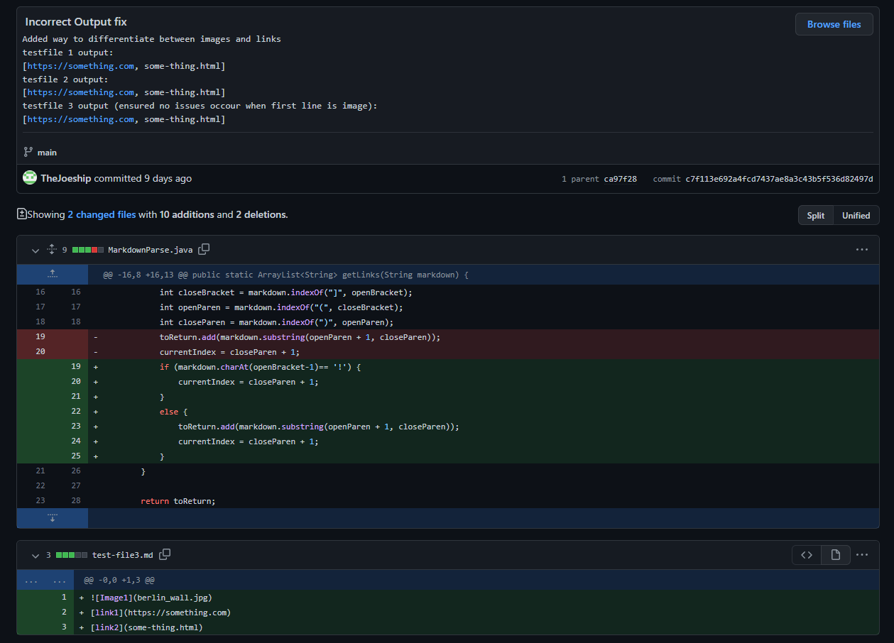
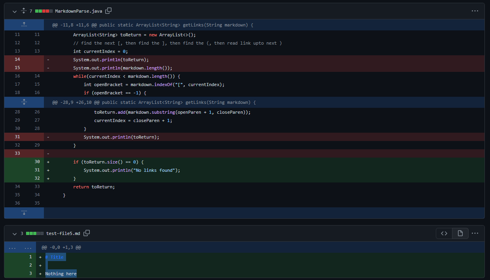
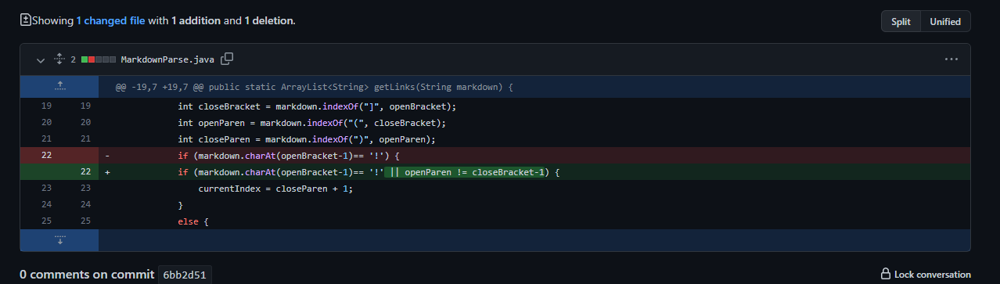

Debugging
================================

Bug 1: Differentiating between links and images
------
The MarkdownParse program is designed to parse links from Markdown files. In this case, the program parsed a [file](https://github.com/TheJoeship/-cse15l-lab-reports/blob/main/test-file3-labrep.md) that contained 2 links and an image. The resulting output was: 

`[berlin_wall.jpg,https://something.com, some-thing.html]`

This is because the program was not built to handle images. The program was orignaly designed to define links as something of the form: ``, images fit this description so the program was reading images as links. So when the program was given a file containing images to read, this bug was foumd. Meaning that the output was an arraylist containg images. 

This behavior was corrected by adding a check to see if the link/image starts with `!`, if it does it is an image and should not be added to the list. This fix can be seen below.

Bug 2: No links found behavior
------

For this testcase the MarkdownParser parsed [this](https://github.com/TheJoeship/-cse15l-lab-reports/blob/main/test-file4-labrep.md) file, a file with no links whatsoever. The resulting output was: 

`[]` 

This is not desireable behavior. Instead of handling a file with no links, all the program does is spit out an empty arraylist. The loop that searches for links finds nothing, so when it finds nothing it simply returns nothing. This means that nothing is printed.

This was corrected by checking the size of the Arraylist and outputting an error message if the size is 0.

Bug 3: Are these actually links?
------

[This](https://github.com/TheJoeship/-cse15l-lab-reports/blob/main/test-file5-labrep.md) file contains no links but items that look deceptively like links. However, the way MarkdownParser was built causes it to recognize these as links. Giving us this output:

`[stuff,pages.com]`

This due to the fact that MarkdownParser is built to find links based on two criteria. 1. The brackets, and 2. the parantheses. It does not care if they are seperated or not, so a file with two seperate items that have brackets and parantheses will not function properly. This behavior can be corrected simply by adding a check to ensure that the found "(" is in front of the ending "]" this ensures that only links are added to the list. This fix can be seen below:

