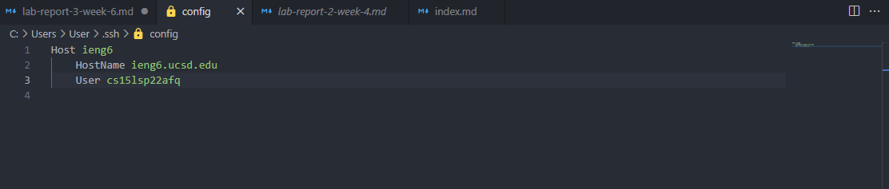
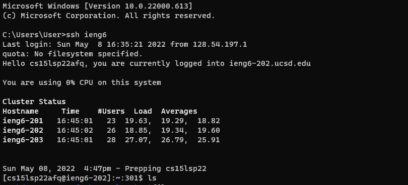
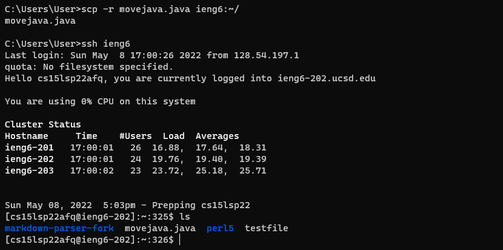
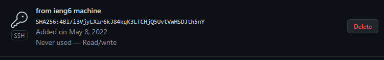
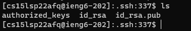
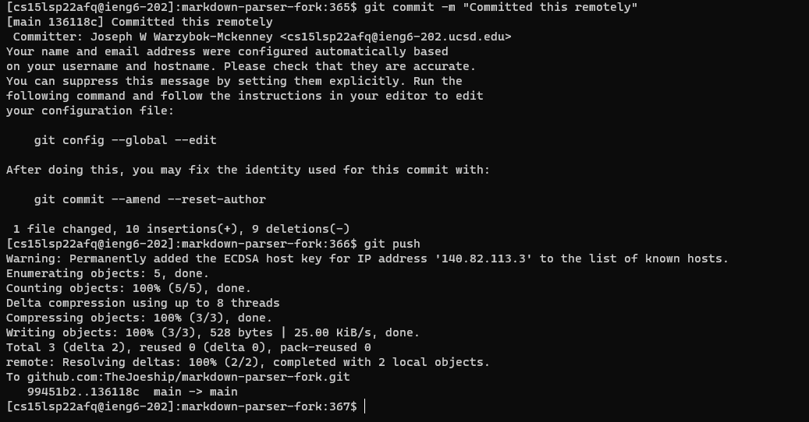
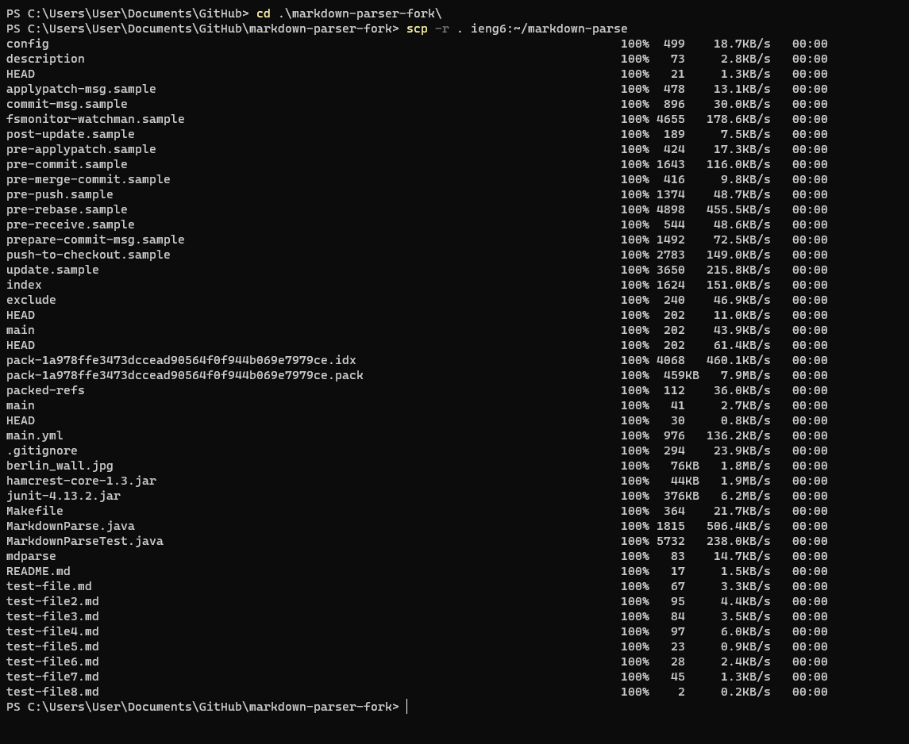
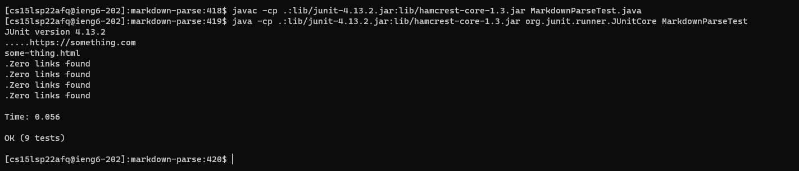
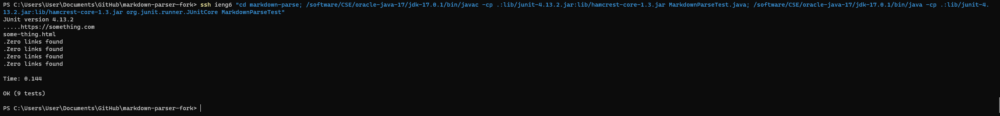

Quality of life additions
=======================

Number 1: Streamlining ssh configuration
------
Typing out the entirety of your ssh login everytime can be quite cumbersome and annoying, so let's go through a process to make that a bit easier.

First let's find our .ssh folder which can be found by typing `cd .ssh` in our command prompt. From there let's access our config file, if it does not exsit go ahead and create one. I opened the file using VScode but you can use whatever editor you prefer. Then input the following info but change the username to match your own:

Now if you go into your terminal and simply type `ssh ieng6` you'll see this!

Great, you've just removed the need to input that clunky username everytime making life much simpler!
You can also do other cool things with this, such as making using `scp` much easier, for example

As you can see this is far easier than the alternative and allows us to very easily move files between systems with minimal effort!

Number 2: Setup Github Acess from ieng6
-------------
In order to push changes we make on our remote machine to github its important to setup our ssh keys. Here you can see where I have my public key stored on github:

And here is where the private key is stored on the remote machine:

Now you can see me running a git commit and push on the remote machine, and not needing to worry about being logged in due to the key. You can also view the commit [here](https://github.com/TheJoeship/markdown-parser-fork/commit/136118cab5f975a75de118445324f896e843c23c)

Number 3: Copying whole directories
----------
Now the way we've been using scp has been copying one file at a time. And this is all fine and good but for large directories this is tedious and timely. Instead we can use `-r` to recursively copy an entire directory. For this example, I'm going to copy my markdown-parse repo over to the remote machine using `scp -r` as seen below:

As you can see all of the files were copied over, now if we head over to ieng6, we can try to run our same JUnit tests:

We can see them work just fine! Now another neat thing is that we can actually run these tests without ever "setting foot" in the ieng6 machine by using scp! Here we use `scp` to remotely connect then we use `;` to seperate multiple commands. The commands we use are `cd` to get into the correct directory. And the long junit javac/java commands to run the tests. As you can see the tests ran perfectly!

