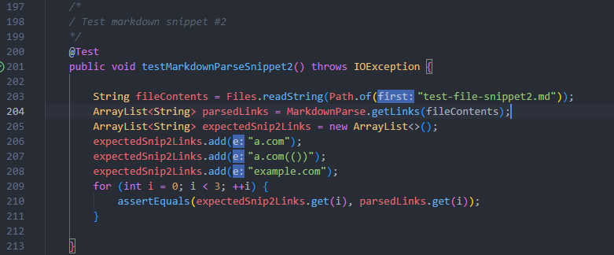

More Markdown-Parse Tests
========================
My Repository: [Link](https://github.com/TheJoeship/markdown-parser-fork)

Other Repository: [Link](https://github.com/TheJoeship/markdown-parser-other-group)

Snippet #1:
=======
This first snippet contains a total of 3 links, while it looks like the first link is a link it isn't, as the beginning of the link is encased by two backticks. This marks the word as code and not part of a link. The second link looks like it should have this issue but doesnt as the first backtick is a part of the link. The other two also do not have this issue as the backticks are inside of the brackets and are treated as text. 

Below you can see the test that I wrote for this file, it expects 3 links and checks to ensure all 3 are parsed.

Running on my repo:
------
After running the test for the first file on my repo I was greeted with a failure which can be seen here:

It appears that Markdownparse.java is reading the first url at the top as an actual url despite the backticks.

Running on reviewed repo:
------
After running the test on the second repo, we're greeted by the exact same result as the first.

Once again this repo is reading that first link encased in backticks as a link which it is not.

A potential fix:
-------
I believe that this fix is quite an easy one. As we can see in the file markdown has no issue with backticks inside of the brackets as those are viewed as text. We can add a simple check that if a potential link has a backtick on the outside (either before the `[` or after the `)`) and a backtick inside of the link (in between the indicies of the `[` and the `)` ), then that is not a link and should not be added.

Snippet #2:
=======

The first link is a nested link within a link. This causes only the nested link to be a valid link, so only a.com is a link, not b.com. The second link is a URL that has parantheses inside of it in the form `(())` this is a part of the link and does not interfere. The final link has brackets inside of the first set of brackets, this does not interfere with the link at all as the inner brackets are treated as text.

Below you can see the test that I wrote for this file, it expects 3 links and checks to ensure all 3 are parsed.

Running on my repo:
------
This file failed due to a string index out of range error. At some point the program was trying to find a character at index -1 which is not possible. It's likely that this was caused by the nested parantheses as the program only searches for pairs and does not know how to handle multiple pairs like this test provides.

Running on reviewed repo:
------
This file also failed due to a string index out of range error, same as before.

A potential fix:
-------
I currently have checks that if either `openParen` or `openBracket` are -1 then to break the loop. They become -1 when the program cannot find them meaning they dont exist. What should fix this is adding the same checks for every variable to ensure it is not -1.

However I believe that this would still not fix our problem as this doesn't fix handling nested parantheses in links. I believe that in order for that fix to be implemented a check would need to be added meaning a loop that loops until it finds the "furthest" paranthese and uses that for the link.

Snippet #3:
=======

The final snippet is all about linke breaks. These line breaks do interfere with the links. The only valid links in this file are those that are "full" links with an https address. A simple ".com" would not sufice as a valid link. 

Below you can see the test that I wrote for this file, it expects 3 links and checks to ensure all 3 are parsed.

Running on my repo:
------
This test fails for the same reason as the second. I suspect this is due to the fact that there are lines in between the link declaration statements causing the program to not find a closing paranthese/bracket.

Running on reviewed repo:
------
This test fails in the same way.

A potential fix:
------------
This problem has to do with dealing with line breaks in between our searches for brackets and parantheses. A potential fix could be with our parsed string. Clearing all whitepsace in our parsed string at the beginning would eliminate any issues with searching in that string. That way the program should be able to find all closing/opening brackets/parantheses with no issues. 