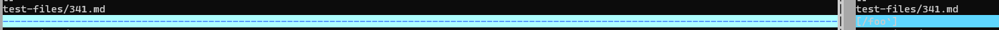
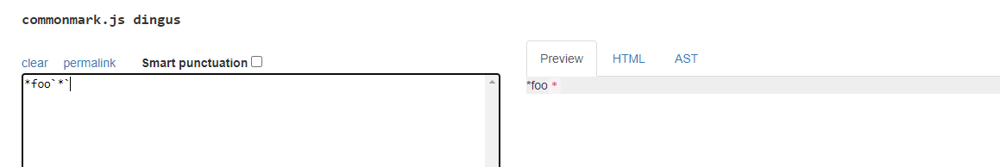
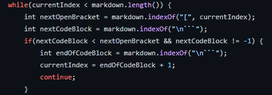
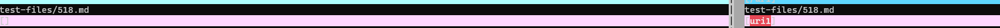
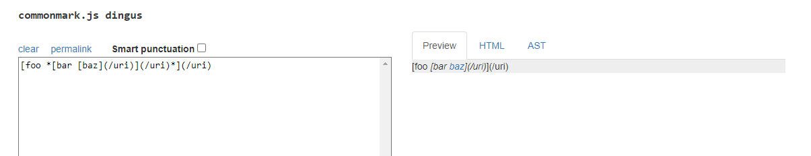
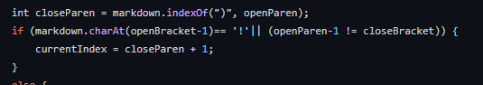

Experimenting with many tests
========================

To find the differences in the tests I found the most effective strategy to be using `vimdiff` and then just picking out tests from there. 

Test #1
------
The result:

The file: [file](https://github.com/nidhidhamnani/markdown-parser/blob/main/test-files/341.md)

As you can see above the test on the left (my repo) did not detect any links however the given repo did on `341.md`. Let's dive in shall we.

Upon further examination it actually looks like this file does not contain a link, as seen in the preview: 

So this means that my implementation is the correct one, as there is nothing in here to indicate that this is a link. But why is this the case? It looks like that in the other repo, there is nothing to handle if no link type markers are found (`[]`,`()`). In fact this file has a check for backticks and I believe that since its only finding backticks and not a link. Because it found backticks its treating it as a link. This can be seen below:

As you can see there is nothing to handle when there is only a codeblock and no link, just both. 

Test #2
------
The result:

The file: [file](https://github.com/nidhidhamnani/markdown-parser/blob/main/test-files/518.md?plain=1)

We have the same situation as last time once again, my repo did not detect any links. Let's take a closer look, upon examination of the contents of the file, displayed here:

In this case it looks like my code is wrong as you can see there is a single link present. My immediate assumption is that this is due to the fact that this file contains many brackets and parantheses. I currently have a check in my code, seen below, that if the closing bracket and parantheses are not next to each other, ignore the link. However in this case my code is picking up the wrong instances of brackets and parantheses, thus ignoring the link. I currently have nothing built into my code to handle such an incident. It would be wise to add a fix where I search through all of the open brackets initially, and find the one thats closest to the close bracket. That way I can ignore earlier ones. I could also add a check where my current check is that checks multiple indicies to see if theres a link. For example I could keep track of all of the brackets/parantheses and find the match within an array.

